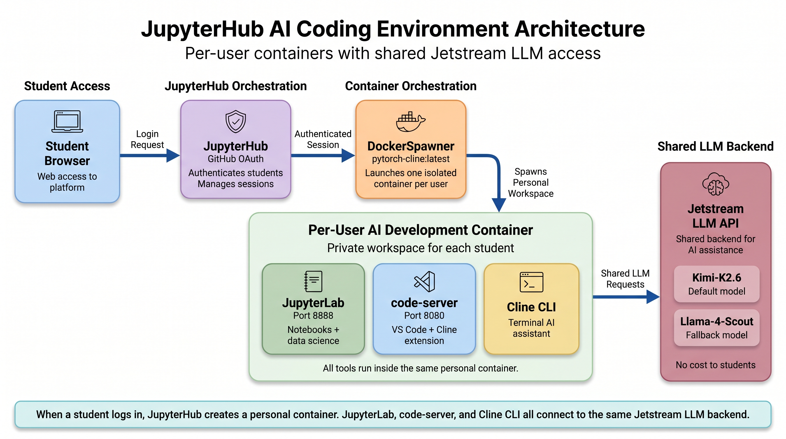

# Cline + VS Code Integration into JupyterHub

> AI-powered coding assistant (Cline) with VS Code (code-server) fully integrated into JupyterHub. Every student gets a pre-configured environment with Kimi-K2.6 via Jetstream LLM — no setup required.

---

## 📌 Quick Access

| | |
|---|---|
| **JupyterHub URL** | https://srp-jupyterhub.nairr240257.projects.jetstream-cloud.org |
| **Login** | GitHub OAuth (NCSU-NNDL-Spring26 org) |
| **LLM API** | https://llm.jetstream-cloud.org/v1 |
| **Default Model** | Kimi-K2.6 |
| **Fallback Model** | Llama-4-Scout |
| **API Key** | Set with `CLINE_API_KEY` in `.env` |

---

## 🏗️ Architecture

This architecture provides each student with an isolated, browser-accessible AI development workspace. By combining notebook-based analysis, VS Code-style development, terminal-based AI assistance, and a shared LLM backend, the environment supports reproducible coding, data science workflows, and AI-assisted learning without requiring students to install local tools.

---

---

## 📁 Repository Files

| File | Purpose |
|------|---------|
| **Dockerfile** | Builds the student container with code-server, Cline extension, Cline CLI, and all pre-configured settings |
| **start-code-server.sh** | Runs on every container start. Writes Cline config files, authenticates the CLI, and launches code-server |
| **jupyterhub_config.py** | JupyterHub configuration with GitHub OAuth, DockerSpawner, GPU access, and allowed users |

---

## 🖥️ How Students Use Cline

**Option 1: VS Code + Cline (Recommended)**

1. Log into JupyterHub
2. Click the **VS Code + Cline** button in the JupyterLab launcher
3. The Cline sidebar opens with Kimi-K2.6 already configured
4. Type your coding task and press Enter

**Option 2: Cline CLI in Terminal**

1. Open a terminal in JupyterLab
2. Run your task directly, for example:
cline "write a PyTorch training loop"

---

## 🤖 Available LLM Models

| Model | Model ID | Notes |
|-------|----------|-------|
| **Kimi K2.6** | `Kimi-K2.6` | Default, best for coding |
| **Llama 4 Scout** | `Llama-4-Scout` | Fallback if Kimi is unavailable |

**Switching Models in VS Code**

Click the model name at the bottom of the Cline sidebar, scroll to **Model ID**, type the new model ID, and click **Done**.

**Switching Models in CLI**
cline auth -p openai-compatible -k "$CLINE_API_KEY" -m Llama-4-Scout -b https://llm.jetstream-cloud.org/v1

**Verifying API and Available Models**
curl https://llm.jetstream-cloud.org/v1/models -H "Authorization: Bearer $CLINE_API_KEY"

---

## ⚙️ Initial Deployment

**Prerequisites**
- Docker installed on the host VM
- NVIDIA GPU with CUDA drivers
- GitHub OAuth App credentials
- jupyterhub-network Docker network created

**Steps**
1. Clone this repository onto the JupyterHub VM
2. Build the Docker image: `docker build -t pytorch-cline:latest .`
3. Update `jupyterhub_config.py` with your OAuth Client ID and Secret
4. Restart JupyterHub: `docker restart jupyterhub`
5. All users log in fresh to get new containers

---

## 👥 Managing Users

Open `jupyterhub_config.py` and add or remove GitHub usernames from the `allowed_users` list, then restart JupyterHub. Only listed GitHub accounts can log in.

To force a user onto the latest image, remove their container. It will be recreated automatically on next login:
docker ps -a | grep jupyter- | awk '{print $1}' | xargs docker rm -f

---

## ⚠️ Known Issues

| Issue | Cause | Solution |
|-------|-------|---------|
| Kimi-K2.6 connection error | Jetstream API temporarily down | Switch to `Llama-4-Scout` |
| 400 OAuth state missing | Browser cookie conflict | Use a private/incognito window |
| Disk full during image build | Docker build cache | Run `docker system prune -f` before rebuilding |
| VS Code + Cline button missing | Container built from old image | Remove old container and log in again |
| Cannot use checkpoints warning | VS Code internal warning | Harmless, safely ignored |

---

## 🔐 Security Notes

- Never commit your GitHub OAuth `client_secret` or `CLINE_API_KEY` to the repository
- The `jupyterhub_config.py` in this repo uses placeholder values — real credentials are stored only on the VM
- Each student container is fully isolated from others
- HTTPS is enforced via Caddy with Let's Encrypt certificates

SHI-NAIRR SRP 2026 — NC State University, ECE Department
